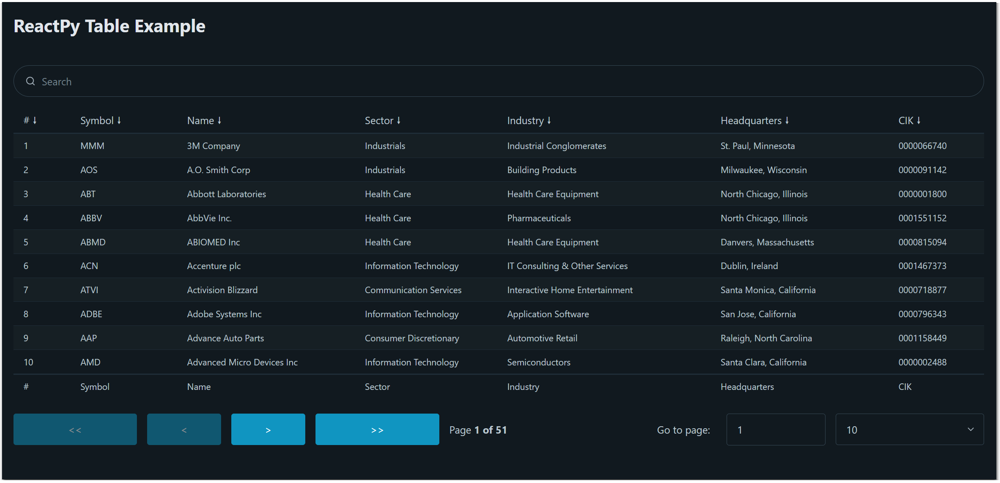

## reactpy-table

Headless UI for building powerful tables with [ReactPy]. The project 
takes its design ideas from the hugely popular, ReactJS based, [TanStack Table].

This initial release supports the following features:

- [X] Headless UI, CSS agnostic
- [X] Free form text search
- [X] Column sort
- [X] Pagination

## Usage

	pip install reactpy-table

[TanStack Table]: https://tanstack.com/table/latest
[ReactPy]: https://reactpy.dev/docs/index.html

